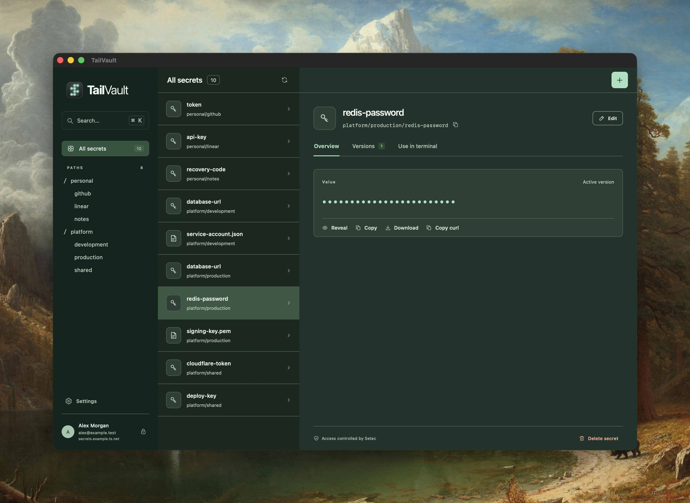

# TailVault

TailVault is an app for viewing and managing [Setec](https://github.com/tailscale/setec)
secrets using your Tailscale identity. Your Tailscale ACLs define which secrets
you can access and which actions you can perform. Setec enforces those permissions.

[](website/secrets.webp)

Requires **macOS 15 Sequoia or later on Apple Silicon**, Tailscale, and a hosted
Setec service on your tailnet.

## Install

```sh
brew install angerops/tap/tailvault
```

Alternatively, download the macOS ZIP from
[Releases](https://github.com/angerops/tailvault/releases), unzip it, and move
**TailVault.app** to Applications.

## Connect

Open TailVault and enter the HTTPS origin supplied by your Setec administrator,
such as `https://setec.tails-scales.ts.net`. Choose **Save and open vault**.

You can change the server later in **Settings** (⌘,).

See the [usage guide](docs/usage.md) for settings, shortcuts, and managing secrets.
